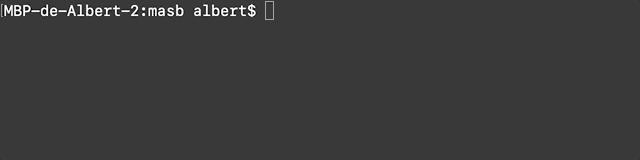

# Microcontroladores para Aplicaciones y Sistemas Biomédicos

Este repositorio lo utilizamos para *hostear* la [**página web**](https://biomedical-electronics.github.io/masb/) del curso/asignatgura **Microcontroladores para Aplicaciones y Sistemas Biomédicos (MASB)**. En la página presentamos los objetivos del curso, así como los recursos docentes utilizados (vídeos, documentos, etc.) y el trabajo realizado por los alumnos.

## Cómo incorporar tu trabajo a la página web

Para incorporar tu trabajo a la página web, realiza los siguientes pasos:

1. Haz un *fork* del repositorio.


2. Clona el repositorio recién incorporado en tu perfil en tu ordenador.


3. Para crear tu post, duplica el archivo `/_posts/template-student.md` en el mismo directorio y renombralo a `YYYY-MM-DD-NOMBRES.md`; donde `YYYY-MM-DD` corresponde al año, mes y día de la fecha de creación del post, y `NOMBRES` a los nombres de los participantes del trabajo separados por guiones.


4. Utiliza tu editor favorito para modificar el archivo recién creado a conveniencia utilizando [Markdown](https://guides.github.com/features/mastering-markdown/) (añadir texto, imágenes, tablas, gráficos, etc.). Mi editor recomendado es [Visual Studio Code](https://code.visualstudio.com/). En el siguiente [enlace](https://guides.github.com/features/mastering-markdown/) encontrarás información sobre cómo aplicar los estilos más básicos. No te olvides de **editar** (que **no añadir**) los campos de [*front matter*](https://jekyllrb.com/docs/front-matter/) adequadamente:

    - `title`: El título de tu trabajo.  
    Ejemplo: `title: "Mi increíble trabajo"`
    - `date`: Fecha de creación del post (debe de corrsponder con la indicada en el nombre del archivo).  
    Ejemplo: `date: 2019-10-15 18:06:40 +0200`
    - `authors`: Autores/participantes del proyecto. Este es un campo que contiene un *array* con todos los participantes del proyecto. a su vez, cada uno de estos elementos tiene una serie de campos que deben de cumplimentarse. Estos son: `name`, `contact` y `picture_path`. En `name` se indica el nombre y apellidos, en `contact`el correo de contacto y en `picture_path` el *path* a una fotografía del autor (se recomienda una imagen [tipo retrado](https://www.google.com/search?q=author+picture&source=lnms&tbm=isch&sa=X&ved=0ahUKEwiqrLfDl5_lAhWB8eAKHaRxCU4Q_AUIEigB&biw=1014&bih=788#imgrc=gpF2AVvLGBa2TM:) con un **tamaño mínimo** de 600px, tanto en altura como ancho).   
    Ejemplo:  
    ```ruby
    authors:
        - name: "Albert Álvarez Carulla"
          contact: "albert.alvarez.carulla@gmail.com"
          picture_path: "assets/imgs/ALBERT-ALVAREZ-CARULLA.jpg"
        - name: "Segundo Autor"
          contact: "segundo.autor@gmail.com"
          picture_path: "assets/imgs/SEGUNDO-AUTOR.jpg"

    ```
    El resto de campos del *front matter* no deben de modificarse.

5. Una vez finalizado el post, este se sube a GitHub mediante un *push* para, finalmente, incorporar el post a la página web mediante un **Pull Request (PR)** al repositorio de origen del *fork*. Al realizar un PR, se lanza un **test automático**. El test chequea que no haya ningún error que comprometa el correcto funcionamiento de la página web (errores en el *markdown*, modificaciones accidentales de otros archivos o enlaces erróneos, entre otros). **Este test debe de ser superado para poderse incorporar el post a la página web**. El resultado del test **aparece en la página del PR**. El author debe de realizar los cambios pertinentes hasta lograr superar el test. Una vez superado, **el administrador de la página web revisará los archivos modificados e incorporará el contenido si está todo correcto**. Si se tuviera que realizar una modificación, el administrador lo indicará directamente en el PR. Una vez aplicados los cambios necesarios, el administrador incorporará el contenido a la página web.
